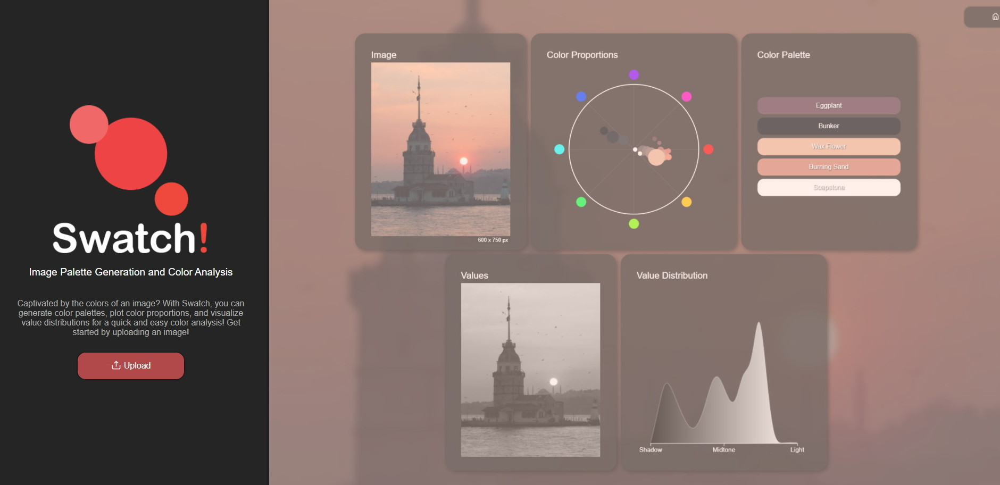
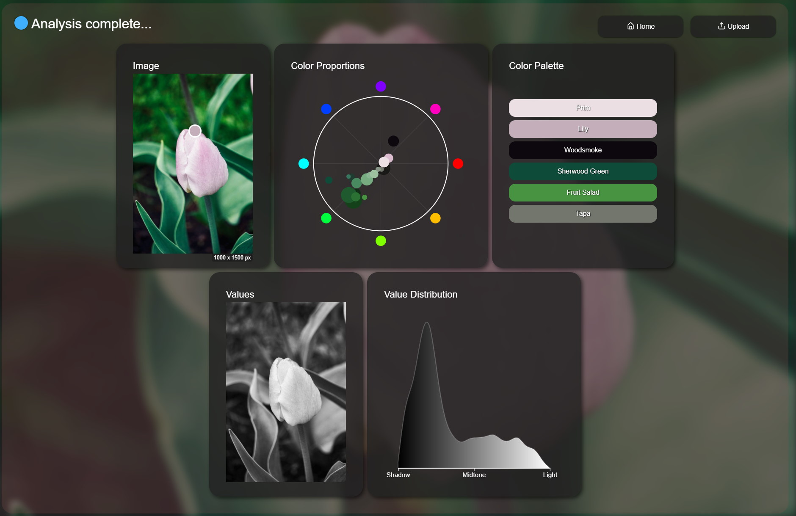

# Swatch! 
[](https://github.com/Kipwisp/swatch-app/blob/master/LICENSE)
[](https://swatch.kipwisp.io)

Swatch is a web application built with Vue.js that allows users to easily analyze the colors of an image and extract color palettes. This app retrieves color statistics for an image by uploading it to a [separate API](https://github.com/Kipwisp/swatch-api). These color statistics are then displayed using interactive D3.js charts that describe the color palette, color proportions, and value distributions which allows the user to easily identify color palettes and color schemes found within an image. View the live app at [swatch.kipwisp.dev](https://swatch.kipwisp.dev)!




## Project Setup
To set up the project, run the following command:
```
yarn install
```

## Environmental Variables
Add the following variables to your .env file:
```
VUE_APP_API=[url_to_api]
VUE_APP_GITHUB=[url_to_github]
```

## Compiling for Development
To compile for development, run the following command:
```
yarn serve
```

## Building for Production
To build for production, run the following command:
```
yarn build
```

## Licensing
This project is licensed under the GNU GPLv3 - see [LICENSE](https://raw.githubusercontent.com/Kipwisp/swatch-app/main/LICENSE?token=GHSAT0AAAAAABSOHVBSAZGEQ7R3JJHDCUSGYRRM2RQ) for details.